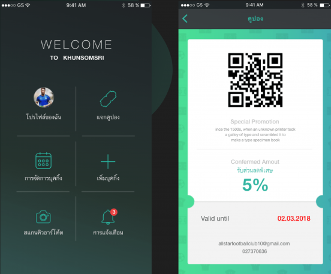
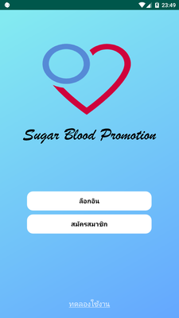
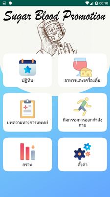
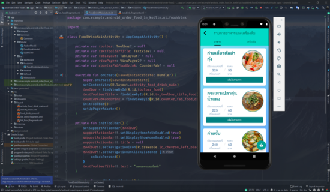
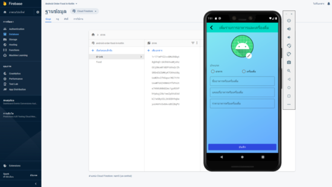
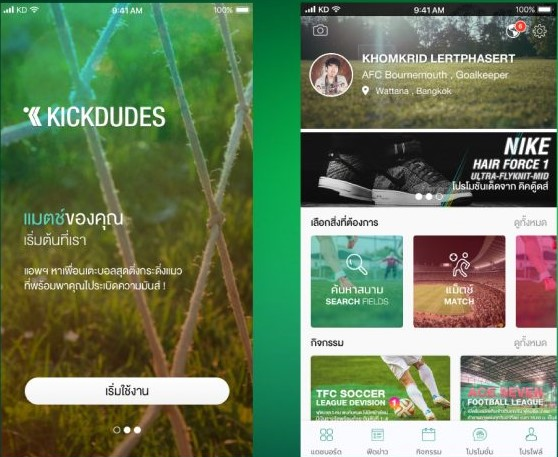

# Portfolio นายกมลเทพ จีนรัตน์

## ผลงานด้าน Application

## Somsri

Somsri App คือ ระบบจัดการของสนามในรูปแบบของ Mobile Application 
 - สิ่งที่ใช้พัฒนา: kotlin
 - ส่วนที่ได้พัฒนา: โปรไฟล์ของฉัน,แจกคูปอง,สแกนคิวอาร์โค้ด,เพิ่มบุคกิ้ง
  
## Diabetes App

Diabetes App คือแอพพลิเคชันบันทึกค่าน้ำตาลในเลือด
 - สิ่งที่ใช้พัฒนา: kotlin
 - ส่วนที่ได้พัฒนา: ปฎิทิน,อาหารและเครื่องดื่ม,บทความทางการแพทย์,กิจกรรมการออกกำลังกาย,ตั้งค่า

## Android Order Food

Android Order Food คือแอพพลิเคชันเพิ่มรายการอาหารและแสดงรายการอาหาร
 - สิ่งที่ใช้พัฒนา: kotlin
 - ส่วนที่ได้พัฒนา: เพิ่มรายการอาหาร,แสดงรายการอาหาร
 - บทความตอนหนึ่ง https://twinsynergy.co.th/android-order-food-in-kotlin/
 - บทความตอนสอง https://twinsynergy.co.th/android-order-food-in-kotlin-%E0%B8%95%E0%B8%AD%E0%B8%99-2/
  
## Kickdudes

Kickdudes Application คือแอพพลิเคชันชวนเพื่อนเตะบอล
 - สิ่งที่ใช้พัฒนา: flutter
 - ส่วนที่ได้พัฒนา: แดชบอร์ด ฟีดข่าว กิจกรรม

## ผลงานด้าน Web Application