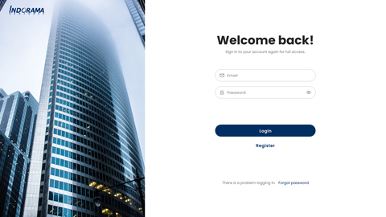

# Portfolio นายกมลเทพ จีนรัตน์

## ผลงานด้าน Application

## Somsri

Somsri App คือ ระบบจัดการของสนามในรูปแบบของ Mobile Application 
 - สิ่งที่ใช้พัฒนา: kotlin
 - ส่วนที่ได้พัฒนา: โปรไฟล์ของฉัน,แจกคูปอง,สแกนคิวอาร์โค้ด,เพิ่มบุคกิ้ง
 - ผลงาน: ตอนทำงานที่ Twin Synergy Co.,Ltd.
  
## Diabetes App

Diabetes App คือแอพพลิเคชันบันทึกค่าน้ำตาลในเลือด
 - สิ่งที่ใช้พัฒนา: kotlin
 - ส่วนที่ได้พัฒนา: ปฎิทิน,อาหารและเครื่องดื่ม,บทความทางการแพทย์,กิจกรรมการออกกำลังกาย,ตั้งค่า
 - ผลงาน: ผลงานโปรเจคจบปริญญาตรี

## Android Order Food

Android Order Food คือแอพพลิเคชันเพิ่มรายการอาหารและแสดงรายการอาหาร
 - สิ่งที่ใช้พัฒนา: kotlin
 - ส่วนที่ได้พัฒนา: เพิ่มรายการอาหาร,แสดงรายการอาหาร
 - บทความตอนหนึ่ง https://twinsynergy.co.th/android-order-food-in-kotlin/
 - บทความตอนสอง https://twinsynergy.co.th/android-order-food-in-kotlin-%E0%B8%95%E0%B8%AD%E0%B8%99-2/
 - ผลงาน: ผลงานส่วนตัว
  
## Kickdudes

Kickdudes Application คือแอพพลิเคชันชวนเพื่อนเตะบอล
 - สิ่งที่ใช้พัฒนา: flutter
 - ส่วนที่ได้พัฒนา: แดชบอร์ด ฟีดข่าว กิจกรรม
 - ผลงาน: ตอนทำงานที่ Twin Synergy Co.,Ltd.

## Plant App

Plant App คือ flutter ui 
 - สิ่งที่ใช้พัฒนา: flutter
 - ส่วนที่ได้พัฒนา: ทั้งหมด
 - Repository: https://gitlab.com/kamonthep026/plant_app_flutter
 - ผลงาน: ผลงานส่วนตัว
  
## ผลงานด้าน Web Application

## Diabetes Web

Diabetes Web คือระบบ Diabetes admin จัดการเพิ่ม ลบ แก้ไข รายการต่างๆ
 - สิ่งที่ใช้พัฒนา: ReactJs, Ant design
 - ส่วนที่ได้พัฒนา: แดชบอร์ด อาหารและเครื่องดื่ม ออกกำลังกาย บทความ ตั้งค่า
 - ผลงาน: ผลงานโปรเจคจบปริญญาตรี

## Kickdudes Web

Kickdudes Web คือระบบ Kickdudes admin จัดการเพิ่ม ลบ แก้ไข รายการต่างๆ
 - สิ่งที่ใช้พัฒนา: ReactJs ,Ant design
 - ส่วนที่ได้พัฒนา: ทั้งหมด
 - ผลงาน: ตอนทำงานที่ Twin Synergy Co.,Ltd.

## Indorama Web

Indorama Web คือ เพื่อใช้งานภายในองค์กรของบริษัท Indorama
 - สิ่งที่ใช้พัฒนา: ReactJs ,Bootstrap
 - ส่วนที่ได้พัฒนา: ทั้งหมด
 - ผลงาน: ตอนทำงานที่ Twin Synergy Co.,Ltd.

## Indorama Admin

Indorama Admin คือ เพื่อใช้งานภายในองค์กรของบริษัท Indorama
 - สิ่งที่ใช้พัฒนา: ReactJs ,Ant design
 - ส่วนที่ได้พัฒนา: ทำ ui ทั้งหมด
 - ผลงาน: ตอนทำงานที่ Twin Synergy Co.,Ltd.
  
## Eba mobile web

Eba mobile web คือ Esports Battle Arena(EBA) คืออะไร,คำถามที่พบบ่อย
 - สิ่งที่ใช้พัฒนา: Next.js ,Bootstrap
 - ส่วนที่ได้พัฒนา: ทั้งหมด
 - ผลงาน: ตอนทำงานที่ Twin Synergy Co.,Ltd.
 - website: https://ebamobile.com/

## Web Events

Web Events คือ แสดงรายการ Events และค้นหา หรือ รายละเอียด Events
 - สิ่งที่ใช้พัฒนา: Next.js 
 - ส่วนที่ได้พัฒนา: ทั้งหมด
 - ผลงาน: ผลงานส่วนตัว
 - Repository: https://gitlab.com/kamonthep026/nextjs-course-code/-/tree/next-events

## V-Bright & V-Wash

V-Bright & V-Wash คือ แสดงรายการผลิตภัณฑ์ทั้งหมดและรายละเอียดสินค้า
 - สิ่งที่ใช้พัฒนา: Gatsby.js
 - ส่วนที่ได้พัฒนา: ทั้งหมด
 - ผลงาน: ตอนทำงานที่ Twin Synergy Co.,Ltd.
 - website: https://ssi-group.co/

## Web App Chat

Web App Chat คือ การสร้างกลุ่ม chat และสามารถคุยกันได้ในกลุ่ม
 - สิ่งที่ใช้พัฒนา: AngularJS
 - ส่วนที่ได้พัฒนา: ทั้งหมด
 - ผลงาน: ผลงานส่วนตัว
 - Repository: https://gitlab.com/kamonthep026/appchatangularjs
